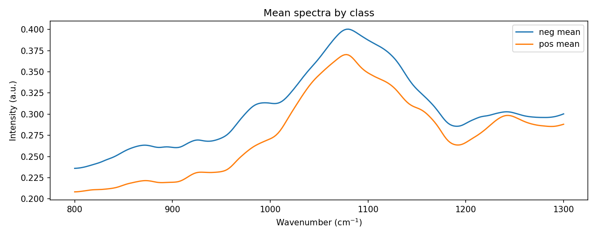
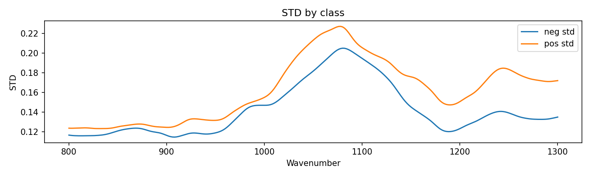
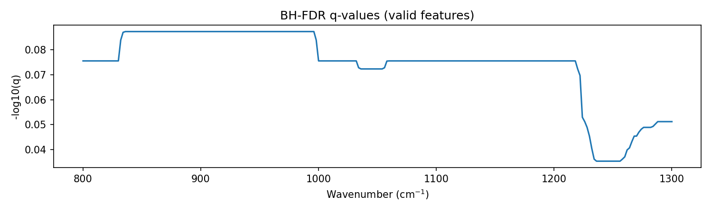
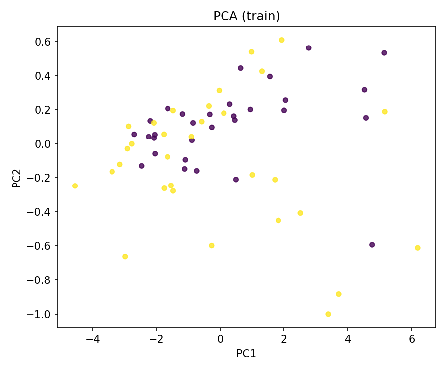
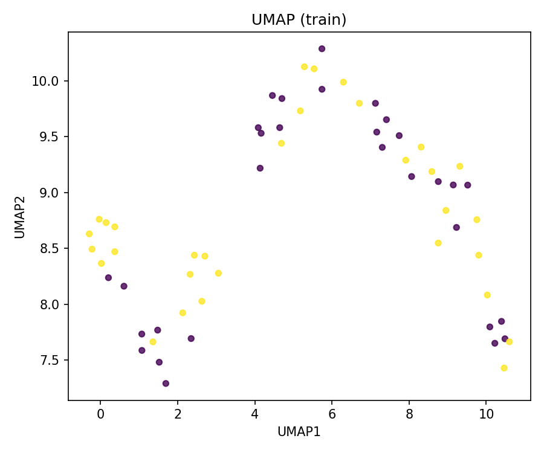
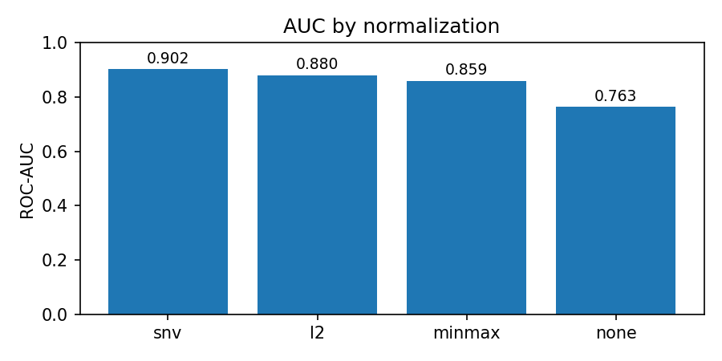
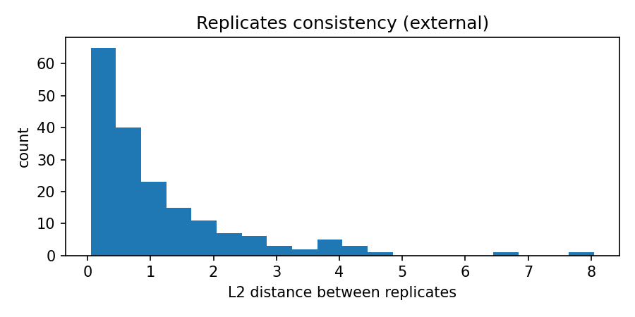

Проект FTIR (НИР): каркас создан.
## Baseline EDA / QC

- `src/prepare_data.py` — сбор обучающего и внешнего наборов, проверка NaN, формирование parquet.
- `src/eda_saliva.py` — базовые графики (средние/STD, PCA/UMAP).
- `src/eda_qc.py` — расширенный QC: p-values (BH-FDR), поиски выбросов (robust Mahalanobis), сравнение нормализаций (GroupKFold ROC-AUC), анализ репликатов.

### Ключевые рисунки

Подробные числа — в `reports/summary.txt`.
